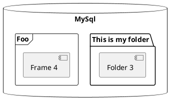

# The Constrained Application Protocol (CoAP)

The Constrained Application Protocol (CoAP) is a protocol intended to be used in low-powered devices and networks. That is networks of very low throughput and devices that run on battery. Such devices often have limited memory and CPU too, being the [class 1](https://tools.ietf.org/html/rfc7228#page-8) devices of 100KB of Flash and 10KB of RAM but targetting environments with a [minimum of 1.5kB](https://ieeexplore.ieee.org/document/6970748) of RAM and about 5 kB of ROM.

CoAP is a [REST](https://www.ics.uci.edu/~fielding/pubs/dissertation/rest_arch_style.htm) protocol largely inspired by HTTP. However it brings the Web Server concept to the very constrained space where IoT devices are the ones exposing their resources.

Like HTTP, CoAP also uses request/response communication, being CoAP messages very small, of tens of bytes on a 6LoWPAN network and of the hundreds of bytes on a less constrained one.

CoAP devices are intended to come from multiple manufacturers, much like the World Wide Web enabled anyone to have an HTTP server. While arriving to a common data modeling and representation form as HTML for HTTP has not yet happened for CoAP, the technology is already mature in terms of networking layout.

Devices may be sensors and actuators, exposing resources (i.e. measurable data) or enabling interaction with the environment. They have to find ways to register to services, find each other, and interact without much human control or intervention.

Ideally we would be talking about a decentralized scenario, as on the Web. However, much like the Web is moving back to the mainframe format, most comertial IoT solutions today feature a central control point, manager, broker or orchestrating entity.