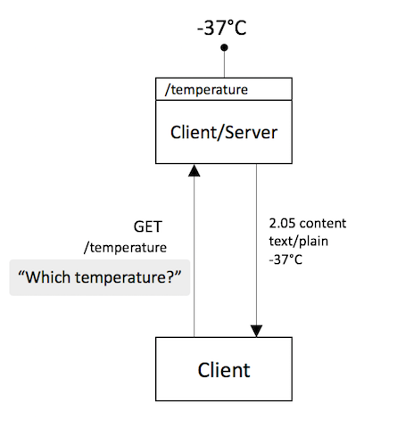
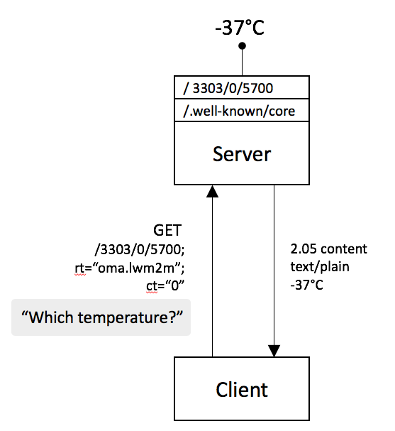
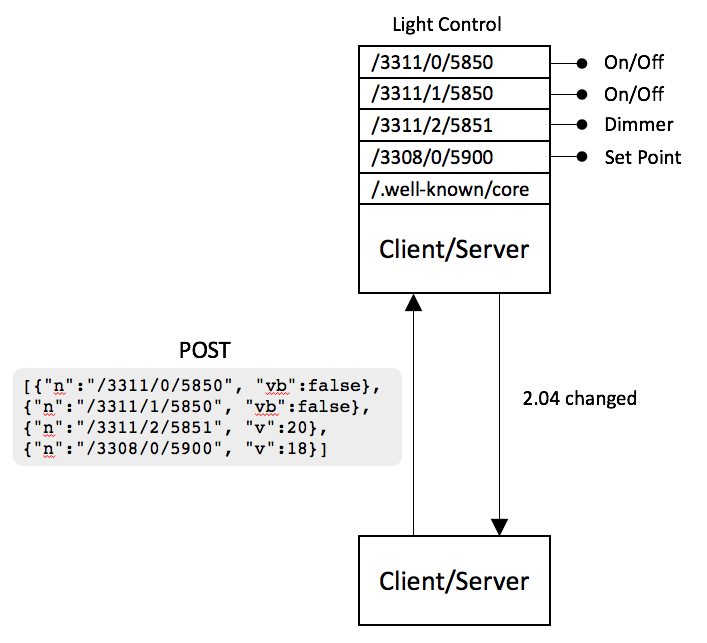

# The Constrained Application Protocol (CoAP)

The Constrained Application Protocol (CoAP) is a protocol intended to be used in low-powered devices and networks. That is networks of very low throughput and devices that run on battery. Such devices often have limited memory and CPU too, often as little as 1.5kB of RAM and about 5 kB of ROM.

CoAP is a [REST](https://www.ics.uci.edu/~fielding/pubs/dissertation/rest_arch_style.htm) protocol largely inspired by HTTP. However it brings the Web Server concept to the very constrained space where IoT devices are the ones exposing their resources.

Like HTTP, CoAP also uses request/response communication, being CoAP messages very small, of tens of bytes on a 6LoWPAN network and of the hundreds of bytes on a less constrained one.

CoAP devices are intended to come from multiple manufacturers, much like the World Wide Web enabled anyone to have an HTTP server. While arriving to a common data modeling and representation form as HTML for HTTP has not yet happened for CoAP, the technology is already mature in terms of networking layout.

Devices may be sensors and actuators, exposing resources (i.e. measurable data) or enabling interaction with the environment. They have to find ways to register to services, find each other, and interact without much human control or intervention.

Ideally we would be talking about a decentralized scenario, as on the Web. However, much like the Web is moving back to the mainframe format, most comertial IoT solutions today feature a central control point, manager, broker or orchestrating entity.  

## A CoAP Message

As explained in [RFC7252](https://tools.ietf.org/html/rfc7252) CoAP messages are very compact and by default transported over UDP, there is TCP support too for NATed environments, but UDP was the intended original transport. CoAP messages are encoded in a simple binary format with a very compact header of 4 bytes. The `version` indicates the CoAP version, the message `type` can be (`CON`, `NON`, `ACK` and `RST`). This is followed by a variable-length `Token` value, which can be between 0 and 8 bytes long. Then it has the response or method `codes` (e.g. `0.01` (GET) , `0.02` (POST) , `2.05` (Success) , `4.04` (Not Found)). Then there is the Message ID, which is a 16 bit field to detect message duplication. There are then several Options that allow for extensibility and finally the payload with the actual data.

``` md
    0                   1                   2                   3
    0 1 2 3 4 5 6 7 8 9 0 1 2 3 4 5 6 7 8 9 0 1 2 3 4 5 6 7 8 9 0 1
   +-+-+-+-+-+-+-+-+-+-+-+-+-+-+-+-+-+-+-+-+-+-+-+-+-+-+-+-+-+-+-+-+
   |Ver| T |  TKL  |      Code     |          Message ID           |
   +-+-+-+-+-+-+-+-+-+-+-+-+-+-+-+-+-+-+-+-+-+-+-+-+-+-+-+-+-+-+-+-+
   |   Token (if any, TKL bytes) ...
   +-+-+-+-+-+-+-+-+-+-+-+-+-+-+-+-+-+-+-+-+-+-+-+-+-+-+-+-+-+-+-+-+
   |   Options (if any) ...
   +-+-+-+-+-+-+-+-+-+-+-+-+-+-+-+-+-+-+-+-+-+-+-+-+-+-+-+-+-+-+-+-+
   |1 1 1 1 1 1 1 1|    Payload (if any) ...
   +-+-+-+-+-+-+-+-+-+-+-+-+-+-+-+-+-+-+-+-+-+-+-+-+-+-+-+-+-+-+-+-+
```

### Unreliable Transmission

As mentioned before, CoAP was intended for *UDP transmission*, which is unreliable. This means that CoAP request and response messages may arrive out of order, appear duplicated, or go missing without notice. For this reason, CoAP implements a lightweight reliability mechanism using the `type`field, introducing both Confirmable and Non-Confirmable messages. If the messages is CON as in Confirmable, that means that either the request or the response require confirmation, that is an acknowledgemnt of receival or ACK.

To ensure retransmission in case of loss, the CoAP endpoint sending the CON message keeps track of a `timeout` for the message and a `retransmission counter` to keep track of how many times the message was sent.

Below it is shown how a simple CoAP Request would look like. The CoAP Client sends a request message `GET /temperature` that requires requires an acknowledgment message from the server as it uses the type `CON`. The `Message ID` is `0x7d36` which will be used in that acknowledgment message. Without the message ID, a client that makes two GET requests and gets two responses won’t know which response goes with which request. A single CoAP request may trigger several responses, and the same `token` is used in every response, not just the initial acknowledgment. Responses sent after the acknowledgment will have new message IDs, but they’ll be tied to the original request by the token.

Since the first message got lost the client waits for a time until the `timeout` is triggered and the message is sent again.

```md
   Client  Server  (hosting a resource at "/temperature" with 
      |      |       value 22.3 degrees centigrade)
      |      |
      +----X |   Header: GET (T=CON, Code=0.01, MID=0x7d36)
      | GET  |   Token: 0x31
      |      |   Uri-Path: "temperature"
   TIMEOUT   |
      |      |
      +----->|   Header: GET (T=CON, Code=0.01, MID=0x7d36)
      | GET  |   Token: 0x31
      |      |   Uri-Path: "temperature"
      |      |
      |      |
      |<-----+   Header: 2.05 Content (T=ACK, Code=2.05, MID=0x7d36)
      | 2.05 |   Token: 0x31
      |      |   Content-Format: text/plain;charset=utf-8
      |      |   Payload: "22.3 C"
```

In the response you can see a `Content-Format` field explaining the format of the content. This is a CoAP option that will be explained in the next section.


## Linking in CoAP

Web Linking in CoRE is defined by [RFC6690](https://tools.ietf.org/html/rfc6690) in a similar way as HTTP defines it in [RFC5988](https://tools.ietf.org/html/rfc5988) and URI's are defined in [RFC3986](https://tools.ietf.org/html/rfc3986).

### URIs

We will also have to explain briefly what a URI is as it is probably very intuitive since it is part of our daily HTTP browsing. Everyone can recognize the following syntax of the URI scheme.

```md
   foo://example.com:8042/over/there?name=ferret#nose
   \_/   \_____________/\________/\________/ \___/
    |           |            |            |        |
   scheme     authority       path        query   fragment
```

A URI can be classified as a locator, a name, or both. Uniform Resource Locator (URL) refers to URIs that allow for identification *and location* of a resource by describing how to access it on a network. Uniform Resource Name (URN) are used as *globally unique* identifiers. Universally Unique IDentifier ([UUID](https://tools.ietf.org/html/rfc4122)) are unique and persistent URNs that *do not require a central registration authority*.

The URI format is used on pretty much any application protocol in existance, from FTP, HTTP or telnet to CoAP. Some with little variations in the syntax, like that of the email [`mailto`](https://tools.ietf.org/html/rfc6068) or the telephone [`tel`](https://tools.ietf.org/html/rfc3966), as you can see below.

```md
   tel     :                        +34-690-555-1212
   mailto  :   infobot@example.com                      ?subject=issue
   urn:uuid:                        f81d4fa...a0c91e6bf6
   ftp     :// 196.4.160.12        /rfc/rfc1808.txt
   http    :// www.ietf.org        /rfc/rfc2396.txt
   \______/   \________________/ \_________________/\___________/
     |              |                 |                         |
   scheme        authority           path                     query
```

The CoAP URI is similar: `"coap:" "//" host [ ":" port ] path-abempty [ "?" query ]`, the examples below show several usages of it. You can try some yourself at [coap.me](http://coap.me).

```md
   coap://sensor.iot.org:5683 /lamp             ?rt=light-lux#rec=3
   coap://[2001:db8:::1]:5683 /temperature      ?ct=60
   coap://coap.me:5683        /.well-known/core
   \__/  \_________________/\______________/\__________/\___/
     |           |                 |                |           |
   scheme     authority           path            query     fragment
```

### Media Types

To begin explaining the Link format used in CoAP it is important to know other concepts like media-types, content-types, etc. there is a very good [clarification document](https://tools.ietf.org/html/draft-bormann-core-media-content-type-format-00), 

1. **Media-Type** is often abbreviated as "mt", they are stored at the [IANA Registry](https://www.iana.org/assignments/media-types/media-types.xhtml). Originally it was a term that identify the general type like "text" or "audio". Nowadays it is the combination of a `type` and a `subtype` like "audio/ogg", "text/plain" or "text/html". In IoT common media types are used for applications that consume the information like "application/senml+cbor" or "application/link-format".

2. **Content-Type** they are the top `type` Media-Type, optionally associated with parameters (separated from the media type name and from each other by a semicolon).

3. **Content-Coding** are registered in [IANA](http://www.iana.org/assignments/http-parameters) too and they are essentially numbers that identify a *potential transformation to the representation of a resource*. This might sound confusing cause it is, but think about it as a compact way to indicate that you want to compress/deflate/encrypt some resource value. 

4. **Content-Format** is again a number on a registry. This number identifies the combination of a Content-Type and a Content-Coding defined by the [CoAP Content-Formats registry](https://www.iana.org/assignments/core-parameters/core-parameters.xhtml). 

Keeing all this in mind, the following sentence will now make more sense:

**The content-format `60` identifies the `application/cbor` media-type, defined by [RFC7049](http://www.iana.org/go/rfc7049).**

---

CoAP is the Constrained Application Protocol by the IETF for constrained devices and networks.  CoAP is the equivalent of HTTP but for constrained devices. From HTTP it takes multiple characteristics:
It is also client/server type, although endpoints will often be both, so it’d be more of a P2P scenario.
It also uses a smaller subset of methods to operate on resources.
Same key concepts from the web like media types, URLs, URN, etc.
Compact 4 byte header
It was intended to run over UDP, providing reliability at the application layer. This was  done with one of the message types (CON NON ACK RST), basically marking a message as something to be confirmed back.
Nowadays, due mainly to NATting issues in IoT, where you might not be able to have the device initiating the communication always, or the NAT mght be too strict, misconfigured, etc.. We also have TCP support. This was a requirement form OMA.
RD used to register and lookup for devices.

In this example we see a client getting a resource hosted at a coap server.


---

CoAP Core_Link RFC6690 expands the definitions on the web linking RFC and expands it for IoT. 
Adds query string parameters and attributes. These attributes describe information useful in accessing the target link of the relation and provide useful semantic information like in this example that the resource we are accessing is part of the oma organization and it is of type temperature. It also tells us that the content is formatted in plaintext as indicated by the value 0. we could request it in senml-json and then we would be using ct=110 
We also can observe parameters by using CoAP observe option, we can get notifications of state changes in the resources hosted by the coap server. We can even add query parameters like “less than” lt=0, if we want the value to be lower than 0 (-37 in this example).
RFC6690 defines the serialization of links in a formal way as well as defining specific M2M content types.
It also defines a well-known resource which is the well-known/core which is globally reserved. Also can be used with HTTP since it is also reserved there. 
This well-known resource can accept optional query string parameters. So we could use this new content types and resources types to find resources on the device based on attribute and relation. You can see that we are requesting an IPSO temperature resource, with content type 0 (plaintext) and that it has to be observable.
In order to find them and see the links, we can use GET  message with content type and the representation that we want (for example JSON)

This example is the same as before, but now we use OMA’s resource uri (more on that letter) which is the same as asking for the temperature value, we also use a resource type and a content type in which we want the information returned.




