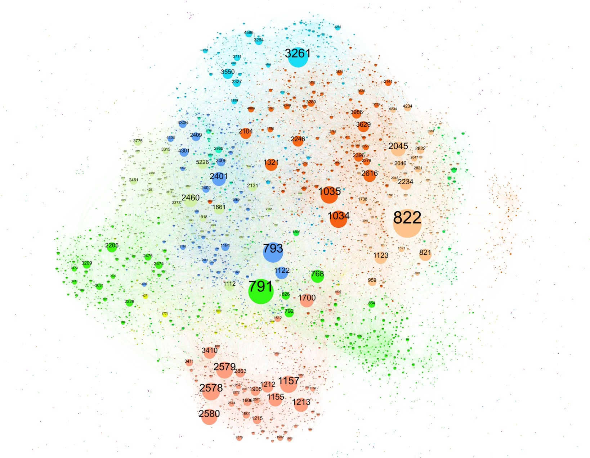
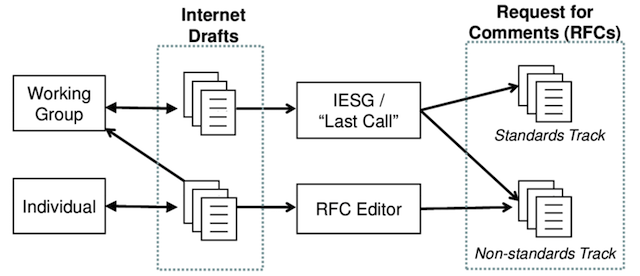

# The Internet Engineering Task Force (IETF)

In 1998 the Internet had about 50 million users, supported by approximately 25 million servers (Web and e-mail hosting sites, for example, but not desktops or laptops). Today the estimation is that some 3.4 billion people are regular users of the Internet, and there are some 20 billion devices connected to it. We have achieved this using some 3 billion unique IPv4 addresses. Looking ahead, there are estimations of several other billions of devices to be soon connected to this network. Noone thought that this feat could be achievable and yet it has happened with almost no fanfare.

A large portion of this success has been done by the work of engineers at organizations that are more or less unknown to the public. Being the Internet Engineering Task Force (IETF) the most prominent.

## What has the IETF done for us anyways?

IETF's mission is **[to make the Internet work better](https://tools.ietf.org/html/rfc3935)**, and it tries to do so by creating high quality, relevant technical documents that influence the way people design, use, and manage the Internet. Those formal documents have behind them consensus and several implementations before they are assigned the usual Request for Comments (RFC) number.  Many of those RFCs have already been implemented and run on every connected machine today:

- [RFC791](https://tools.ietf.org/html/rfc791) The Internet Protocol.
- [RFC792](https://tools.ietf.org/html/rfc792) The Internet Control Message Protocol.
- [RFC821](https://tools.ietf.org/html/rfc821) The Simple Mail Transfer Protocol.
- [RFC768](https://tools.ietf.org/html/rfc768) User Datagram Protocol.
- [RFC959](https://tools.ietf.org/html/rfc959) The File Transfer Protocol.
- [RFC793](https://tools.ietf.org/html/rfc793) The Transmission Control Protocol.
- [RFC854](https://tools.ietf.org/html/rfc854) Telnet Specification.
- [RFC1119](https://tools.ietf.org/html/rfc1119) Network Time Protocol.
- [RFC1157](https://tools.ietf.org/html/rfc1157) A Simple Network Management Protocol.
- [RFC1035](https://tools.ietf.org/html/rfc1035) Domain names - implementation and specification.
- [RFC1945](https://tools.ietf.org/html/rfc1945) Hypertext Transfer Protocol.
- [RFC1964](https://tools.ietf.org/html/rfc1964) The Kerberos Version 5 GSS-API Mechanism.
- [RFC2131](https://tools.ietf.org/html/rfc2131) Dynamic Host Configuration Protocol.
- [RFC2246](https://tools.ietf.org/html/rfc2246) The TLS Protocol Version.
- [RFC2328](https://tools.ietf.org/html/rfc2328) The Open Shortest Path First routing protocol.
- [RFC3261](https://tools.ietf.org/html/rfc3261) The Session Initiation Protocol.
- [RFC6455](https://tools.ietf.org/html/rfc6455) The WebSocket Protocol.
- [RFC5321](https://tools.ietf.org/html/rfc5321) Simple Mail Transfer Protocol.
- [RFC7540](https://tools.ietf.org/html/rfc7540) Hypertext Transfer Protocol Version 2.
- [RFC6749](https://tools.ietf.org/html/rfc6749) The OAuth 2.0 Authorization Framework.
- [RFC4271](https://tools.ietf.org/html/rfc4271) The Border Gateway Protocol.
- [RFC4287](https://tools.ietf.org/html/rfc4287) The Atom Syndication Format.
- [RFC4251](https://tools.ietf.org/html/rfc4251) The Secure Shell (SSH) Protocol Architecture.
- [RFC8200](https://tools.ietf.org/html/rfc8200) Internet Protocol, Version 6 (IPv6) Sepcification.

While most RFCs are just proposals, miscellaneous protocol descriptions, or opinion/information documents, there are true *Internet Standards* among the RFCs and are maintained by the [RFC Editor](http://www.rfc-editor.org/standards).

For the reader's pleasure I also copied two fantastic summaries of the changes that have happened to the Internet in a couple of decades:

- [A decade of Internet Evolution (2008)](./10years.md)
- [Another 10 years (2018)](./another10years.md)

You can also explore the RFC universe courtesy of [Peter Krantz](https://www.peterkrantz.com/v11n/rfc/).

## IETF Organization

As explained at the [IETF website](https://www.ietf.org/about/who/), the technical work of the IETF is done in its [working groups](https://www.ietf.org/how/wgs/), which are organized by topic into several areas (e.g., routing, transport, security, etc.). The IETF working groups are grouped into areas, and managed by Area Directors, or ADs. The ADs are members of the Internet Engineering Steering Group ([IESG](https://www.ietf.org/glossary.html#IESG)).

Much of the work in the IETF is handled via [mailing lists](https://www.ietf.org/list/). The IETF holds [meetings](https://www.ietf.org/how/meetings/) three times per year. [IETF Hackathons](https://www.ietf.org/how/runningcode/hackathons/) encourage collaboration on developing utilities, ideas, sample code, and solutions that show practical implementations of IETF standards. More recently GitHub has become a prevalent way to track the work and interact with developers more smoothly; for example [CoRE](https://github.com/core-wg), [HTTP](https://github.com/httpwg) or [TEEP](https://github.com/ietf-teep) use it regularly.

The Internet Architecture Board, ([IAB](https://www.ietf.org/glossary.html#IAB)) is responsible for defining the overall architecture of the Internet, providing guidance and broad direction to the IETF. The IAB also serves as the technology advisory group to the Internet Society [ISOC](https://www.ietf.org/glossary.html#ISOC)).

There are very detailed guideline documents like [RFC2418](https://tools.ietf.org/html/rfc2418) that explain how WGs are created and what the roles of each individual are, but at a high level the IETF relies on **"rough consensus and running code"**.

## A draft's lifetime

It all starts with an author of set of authors that want to propose some solution for a specific problem they are facing. Usually the problem requires some interoperability and thus an Internet draft seems like the right approach.

1. An Internet draft is first publish as an *individual submission* by one or more authors. Literally anyone can write a draft and the requirements on that submission are very low. 

2. Once the submission gets the attention of the Working Group, by discussing it on the mailing list, presenting it, doing implementations or evaluation... then the group can *adopt it* by doing a *Working Group Adoption (WGA)* call. Once agreed the document becomes a *working group internet draft*.

3. The draft will then go through **many** iterations and revisions, interop events, discussions, errata, and so on before the group thinks it is ready for *Working Group Last Call* which is the moment in which the group decides that the document is ready for publication.

4. After that the document is sent to the [Internet Engineering Steering Group (IESG)](https://www.ietf.org/about/groups/iesg/) for final review, [IANA](https://www.iana.org/) will due its due process and other and other editing will be done by/with the RFC Editor. After some time the document gets assigned an RFC number and is published. 

5. After several years, providing there is industry adoption and the document is on the Standards Track i.e. it is not informational, the document may be come an Internet Standard. This whole process takes a long time and it can feel a bit slow, but at least the out put has guarantees of *some* consensus and *some* running code.

## Contributing to IETF

The IETF is built by volunteers, if you are interested to take part, the best thing you can do is to start by reading [the Tao](https://www.ietf.org/about/participate/tao/) of the IETF.

You then select a Working Group that fits your research/development interests and try to see which is the state of the art there. Most groups have a [charter document](https://datatracker.ietf.org/wg/core/charter/) that explains the why the group exists and what the purpose for the group is. In that same page you will have links to the many communication tools you can use.

- **Mailing lists** are the primary form of communication, they usually start with the group name and then `@ietf.org`, like <core@ietf.org>.

- **jabber** rooms work in a similar fashion <core@jabber.ietf.org>. However XMPP is used less and less these days.

- Some groups have **interim meetings** which are online videoconferencing calls. Those are published on the mailing list.

- Although the IETF doe snot run their own GitLab servers, **Github** is nevertheless used for collaboration and for tracking issues raised by the group and the authors. One example is <http://core-wg.github.io>

- Finally, the best and most effective way of collaborating have been the **face to face** meetings happening three times a year. They can also be joined online.