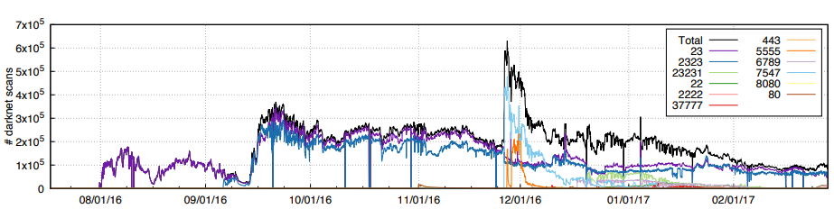

# Security Engineering

There is a wealth of literature on the topic of Internet and Systems Security, but [Security Engineering by Ross Anderson](https://www.cl.cam.ac.uk/~rja14/book.html) in particular is a great authoritative and readable source, it is also free. Also [Dave Dittrich's website on DDOS](https://staff.washington.edu/dittrich/misc/ddos/index.html) with hundreds of examples and news pointers.

It would be impossible to go through all potential Internet attacks and IoT security vulnerabilities here. We will focus on one type, the Distributed Denial-of-Service (DDOS) Attack in the context of IoT and CoAP.

## Distributed Denial-of-service (DDOS) Attacks

The purpose of any denial-of-service attack is to limit the availability of a service. A DDOS attack tries to disrupt a machine in the network, *preventing it to fullfil its service by flooding it with traffic from many different sources* until the resources of the target are exhausted (i.e., memory, processing capabilities, or Internet bandwidth). This effectively makes it impossible to stop the attack simply by blocking a single source.  

Distributed denial-of-service (DDoS) attacks came to public notice when
they were used to bring down Panix, a New York ISP, for several days in 1996.
Over time [it popularized](https://staff.washington.edu/dittrich/misc/ddos/), being used even to hit 6 out of the 13 [ROOT DNS servers](https://www.icann.org/en/system/files/files/factsheet-dns-attack-08mar07-en.pdf) back in 2007.

DDOS has become a mechanism for extorsion, using DDOS to blackmail ISPs or Internet Services. The modus operandi consists on assembling a botnet and flooding a target webserver with traffic until its owner paid them to desist. While originally substantial sums were paid (e.g., $10,000–$50,000) nowadays the process has been simplified to the point that marketplaces to hire DDOS services exist. The services are as cheap as [15€ a month](https://www.europol.europa.eu/newsroom/news/world%E2%80%99s-biggest-marketplace-selling-internet-paralysing-ddos-attacks-taken-down).

The existence of outdated IoT devices is also a great breeding ground for more attacks, as 2016 [Mirai's](https://static.googleusercontent.com/media/research.google.com/en//pubs/archive/46301.pdf) botnet, used to perform very large (600Gps) DDOS attacks using an average of 300.000 infected devices (i.e., DVRs, IP cameras, routers, and printers) and as many as 600000.



## Using UDP-based protocols

Although Mirai's attack was using TCP protocols to attack, it required compromising the host before hand. With UDP attacks you can get high amplification factors *without* the need to hack anything.

UDP is a simple, connection-less transport protocol. It has no handshaking and no dedicated end-to-end connection, therefore there is no guarantee of delivery. However, being so small it is very lightweight and it provides multicast possibility both features very useful in the IoT context where normally the communication ar small messages with few requests and responses.

However, being so small it is very lightweight and it provides multicast possibility both features very useful in the IoT context where normally the communication ar small messages with few requests and responses.

There are some drawbacks of using UDP though as it leaves the door open to two types of attacks: *IP Address Spoofing* and *Packet Amplification*

### IP Address Spoofing

The [UDP](https://tools.ietf.org/html/rfc768) header consists of 4 fields [`source` and `destination` ports, `length` and `checksum`], each of which is 2 bytes being then the header 8 bytes in total. After that we have the 20 byte [IP](https://tools.ietf.org/html/rfc8200) header which contains, among other things `version`, `source` and `destination` address. If we want to avoid packet fragmentation that leaves about 1280B for IPv6 and 576 for IPv4. A rudimentary IPv6 packet would be:

```txt
    ---------------------------------------------
   | 40B IPv6  |  8B UDP  |   1024 bytes payload |
    ---------------------------------------------
```

The IP Spoofing attack consists on an attacker sending such IP packet but with a spoofed source IP address. That fake address being the address of the victim.

```txt
Attacker: IP = 1.1.1.1
 |    -------------------------------------------
 |   | IPs 3.3.3.3 , IPd 2.2.2.2 | UDP | Payload |
 |    -------------------------------------------
 v
Intermediary: IP = 2.2.2.2
 |    -------------------------------------------
 |   | IPs 2.2.2.2 , IPd 3.3.3.3 | UDP | Payload |
 |    -------------------------------------------
 v
Victim: IP = 3.3.3.3
```

IP Spoofing over UDP is particularly easy as the *Attacker* does not require any information about the communication between the *Intermediary* and the *Victim*. Over [TCP](https://tools.ietf.org/html/rfc793) the *Attacker* would somehow have to sit between the *Intermediary* and the *Victim* in order to forge the IP address as there is a connection establishment handshake.

### Packet Amplification

Packet amplification is another potential attack carried out over UDP-based application protocols that implement some form of request/response mechanism. The dynamics are simple and it is used together with IP Spoofing.

```txt
               IP Spoofed                Large
                Request    +---------+  Response
              +----------> | Interm  +------------+
              |            +---------+            |
              |                                   v
+----------+  |            +---------+        +---+----+
| Attacker |  +----------> | Interm  +------->+ Victim |
+----------+  |            +---------+        +---+----+
              |                                   ^
              |            +---------+            |
              +----------> | Interm  +------------+
                           +---------+
```

The attacker will use Intermediary nodes as to craft a request that will generate a large response from them. That response will go to the Spoofed Address of the Victim. Depending on the amplification factor an attacking machine could amplify 1MBps on the first machine to `number-of-devices * (1 MBps * Amplification Factor)`.